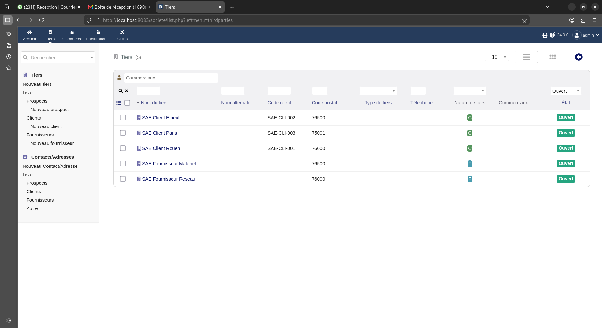

# SAE — Déploiement de Dolibarr

## Objectif
Déployer Dolibarr avec une base MariaDB séparée, gérer des clients
et fournisseurs, puis automatiser l'installation, l'import CSV
et la sauvegarde/restauration.

## Environnement
- Ubuntu 24.04
- Docker et Docker Compose v2
- Dolibarr et MariaDB dans deux conteneurs
- Accès local : http://localhost:8080

## Configuration
Le fichier compose.yaml décrit les services et les volumes.
Les mots de passe sont placés dans .env, exclu du dépôt Git.
Le fichier .env.example fournit les variables à renseigner.

## État du projet
- Installation manuelle réalisée.
- Comptes administrateur et utilisateur standard créés.
- Accès aux tiers testé avec le compte standard.
- Trois clients et deux fournisseurs importés par CSV.
- Six tiers présents, avec le client créé manuellement.

## Stockage
- db_data : base MariaDB.
- documents : documents Dolibarr.
- custom : extensions personnalisées.

La sauvegarde complète et la restauration restent à mettre en place
et à tester.

## Travail restant
- Script install.sh.
- Script import_csv.sh.
- Sauvegarde et test de restauration complète.
- Documentation des procédures et des tests.

## Journal
Voir suivi_projet.md pour les étapes réalisées.


## Test de restauration — PRA

Le PRA (plan de reprise d’activité) permet de remettre
Dolibarr en service à partir d’une sauvegarde.

Éléments sauvegardés :
- base MariaDB dans dolibarr.sql ;
- documents ;
- modules personnalisés ;
- configuration conf.php, compose.auto.yaml et .env.

La restauration a été réalisée dans un environnement Docker
séparé, nommé sae-dolibarr-auto-pra, accessible sur
http://localhost:8083.

La base a été importée, les fichiers restaurés et les
permissions adaptées au serveur web.

Vérification du 3 octobre 2026 :
- connexion avec le compte administrateur réussie ;
- trois clients et deux fournisseurs présents.



Les sauvegardes et le fichier .env sont exclus du dépôt Git
car ils peuvent contenir des informations confidentielles.
La procédure détaillée est disponible dans [le guide de restauration](docs/restauration.md).


## Installation automatique

Prérequis : Git, Docker et Docker Compose V2 installés.

### Préparer le projet sur une nouvelle machine

```bash
git clone https://github.com/haninemounsi23/sae-dolibarr.git
cd sae-dolibarr
cp .env.example .env
chmod 600 .env
nano .env
```

Renseigner ces trois variables avec les mots de passe choisis :

```dotenv
MARIADB_ROOT_PASSWORD=mot_de_passe_root_a_remplacer
MARIADB_PASSWORD=mot_de_passe_base_a_remplacer
DOLI_ADMIN_PASSWORD=mot_de_passe_admin_a_remplacer
```

Ajouter DOLI_ADMIN_PASSWORD si cette variable est absente
du fichier exemple. Le fichier .env reste sur la machine
et ne doit pas être envoyé sur GitHub.

### Lancer l’installation

```bash
chmod +x install.sh import_csv.sh
sudo ./install.sh
```

Attendre la fin de l’installation de Dolibarr, puis ouvrir
http://localhost:8082.

Identifiant : admin.
Mot de passe : valeur choisie pour DOLI_ADMIN_PASSWORD
lors de la première installation.

Dans la configuration des modules, activer la gestion
des tiers et des fournisseurs si nécessaire.

## Import automatique du CSV

Le fichier data/tiers_sae.csv contient cinq tiers fictifs :
trois clients et deux fournisseurs.

Simuler l’import :

```bash
sudo ./import_csv.sh --simulate data/tiers_sae.csv
```

Si la simulation réussit, effectuer l’import :

```bash
sudo ./import_csv.sh data/tiers_sae.csv
```

Vérifier ensuite les cinq tiers dans l’interface Dolibarr
sur http://localhost:8082.

Un second import du même fichier a été testé :
les cinq tiers existants sont ignorés, sans création de doublons.

## Guides techniques

- [Créer une sauvegarde](docs/sauvegarde.md)
- [Restaurer Dolibarr](docs/restauration.md)

## Construction Docker

Le Dockerfile utilise l’image dolibarr/dolibarr:24.0.0
et ajoute les informations du projet.

Le script install.sh lance Docker Compose avec --build
pour construire l’image locale sae-dolibarr:24.0.0
avant de démarrer les services.
